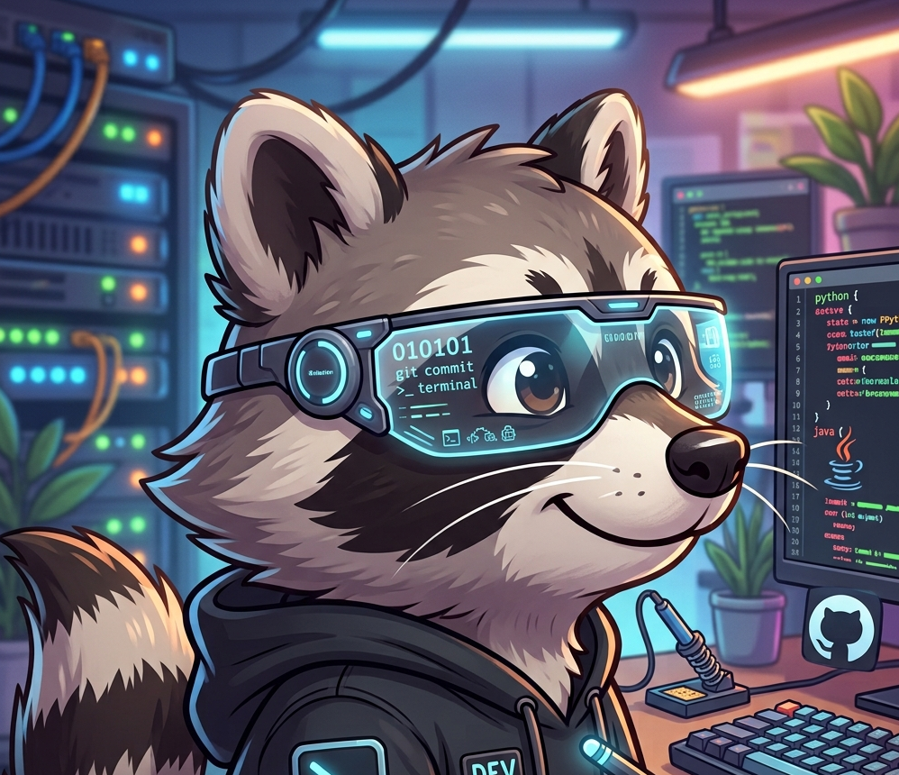

<table width="100%">
<tr>
<td width="30%" align="center">

</td>
<td width="70%">

 

Desenvolvedor focado em **automação e desenvolvimento web**. Menos tarefas repetitivas, mais processos automatizados.

  

Atualmente aprofundando **Linux, Docker, infraestrutura e práticas de DevOps**.

  

</td>
</tr>
</table>

 

## 🧠 Linguagens

## 🎨 Frontend & UI/UX

## 🗄️ Backend & Banco de Dados

## 🧰 Ferramentas

 

## 🚀 Em foco no momento

| Área | O que estou fazendo |
|---|---|
| 🌐 Web | Aplicações com Next.js, priorizando performance e conversão |
| ⚙️ Automação | Scripts em Python e Bash substituindo tarefas manuais |
| 🐳 DevOps | Docker, Linux e infraestrutura de deploy |
| 📐 Arquitetura | Decisões de design de sistema e boas práticas |

 

## 🐍 Snake de contribuições

<picture>
  <source media="(prefers-color-scheme: dark)" srcset="https://raw.githubusercontent.com/raven-aaron/raven-aaron/output/github-contribution-grid-snake-dark.svg">
  <source media="(prefers-color-scheme: light)" srcset="https://raw.githubusercontent.com/raven-aaron/raven-aaron/output/github-contribution-grid-snake.svg">
  
</picture>

 

## 📊 GitHub Stats

 

 

